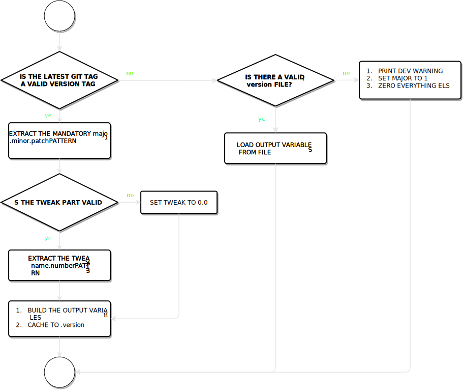

# cmake-git-versioning
Auto update a CMake project version from Git tags.

<br>

## Usage

<br>

1. Check that git exists, eg: 
    ```cmake 
        find_package(Git)
        if(GIT_FOUND)
            message("Git found: ${GIT_EXECUTABLE}")
        else()
            message(FATAL_ERROR "Git not found!")
        endif()
    ```

2. Include the module:
    ```cmake
    include("path/to/cmake-git-versioning.cmake")
    ```

3. You now have access to the [Output Variables](#output-variables).

<br>

When you want to update the current version of your project, tag a commit with a [version tag](#version-tag-syntax). The most recent version tag found is taken as the current version.

<br>

## Internal Behavior

<br>

### Notes

<br>

This module:

- Uses `GIT_FOUND` to check if git is present.
- Uses `GIT_EXECUTABLE` to call git.

<br>

### Quick flowchart

<br>



<br>

### Details

<br>

The module won't start if git is not found.
\
If git is found, it queries the latest tag.
\
If no tag is found it checks the `.version` file.
\
If the latest tag does not contain the mandatory `major.minor.patch` pattern, the tag is not considered a valid version tag. It checks `.version` for the latest version cached.
\
If the tag is valid, it checks for a `-tweak.number` part. If not present/valid, it defaults it to `0.0`.
\
Finally builds the output variables and cache them to `.version` in the project root directory.
\
\
When checking `.version`, if it corrupted or it doesn't exist, sets the current major number to `1` and everything else at `0`. This is the last resort to pass CMake a valid version when calling `project`.

<br>

### <p id="version-tag-syntax">Valid version tag syntax</p>

<br>

Git version tag syntax: 

    [something]<Major>.<minor>.<patch>[-<tweak_name>[.<tweak_number>]]

<br>

## Output Variables

<br>

The following variables will be set ( eg. complete latest git version tag: `v2.3.1-RC.7` ) :

<br>

- `PROJECT_VERSION_STRING` 
    > Version string without metadata. Directly corresponds to the latest version tag (`v2.3.1-RC.7`)

- `PROJECT_VERSION_STRING_FULL`
    > Version string with added git metadata (`v2.3.1-RC.7+21.ef12c8`)

- `PROJECT_VERSION` 
    > Same as `PROJECT_VERSION_STRING`, without preceding letters (`2.3.1-RC.7`)

- `PROJECT_VERSION_MAJOR` 
    > Major version number (`2`)

- `PROJECT_VERSION_MINOR`
    > Minor version number (`3`)

- `PROJECT_VERSION_PATCH`
    > Patch version number (`1`)

- `PROJECT_VERSION_MMP` 
    > Simple `major.minor.patch` version string (`2.3.1`)

- `PROJECT_VERSION_TWEAK_NAME`
    > Tweak version name (`RC`)

- `PROJECT_VERSION_TWEAK_NUMBER`
    > Tweak version number : (`7`)

- `PROJECT_VERSION_TWEAK_FULL`
    > Tweak version full string (`RC.7`)

- `PROJECT_VERSION_COMMITS_AHEAD`
    > Number of commits ahead of last tag (`21`)

- `PROJECT_VERSION_COMMIT_SHA`
    > Git SHA1 of the most recent commit (`ef12c8`)

- `PROJECT_VERSION_CMAKE`
    > CMake compatible VERSION string, uses the `_TWEAK_NUMBER` as the build number (`2.3.1.7`)

<br>

## Acknowledgements

<br>

This module was inspired by the public domain [cmake-git-semver](https://github.com/nunofachada/cmake-git-semver).

<br>

[License](https://github.com/emanuelemessina/cmake-git-versioning/blob/master/LICENSE)
